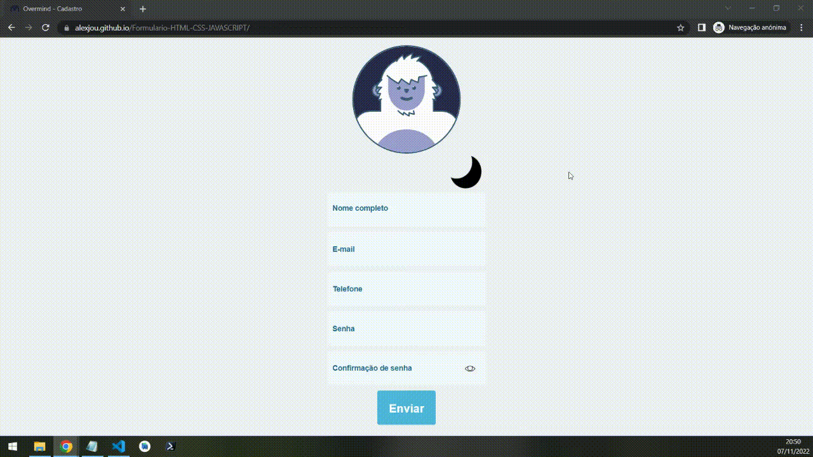

<h1 align="center">OVERMIND</h1>

<h1 align="center">

</h1>

# Link: [URL](https://alexjou.github.io/Formulario-HTML-CSS-JAVASCRIPT/)

## Teste: Formulário Básico

Este teste consiste em construir um formulário cadastral básico, utilizando qualquer - ou nenhum - framework de frontend, que permita um acesso direto por um arquivo .html e que apresente:

- Nome completo
- Email
- Telefone
- senha e validação de senha
- botão de enviar

Ao clicar em enviar, a página deverá enviar o conteúdo do formulário para caroline-brod@overmind.ai

O formulário necessariamente precisará ser responsivo. A interação via desktop deverá ser prioritária, mas ele deverá preservar a navegabilidade em smartphones.

O estilo do formulário é completamente livre, e as escolhas de interação e cores serão também critérios desta avaliação.

Diferenciais:
- possibilidade de alternar entre modo dia (interfaces claras) e modo noite (interfaces escuras)
- interações animadas em focus, hover e quaisquer outras que julgar pertinentes à proposta
- popup de confirmação após clicar em enviar

Serão avaliados a completude dos requisitos:

✔️  Organização do código (independente da tecnologia utilizada)
✔️  Limpeza
✔️  Facilidade de entendimento.
